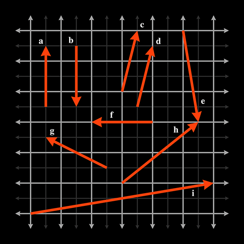

## Exercise

Give the values of the following vectors. The darker grid lines represent one unit.

## Solution

| vector | x   | y   |
| ------ | --- | --- |
| a      | 0   | 2   |
| b      | 0   | -2  |
| c      | 0.5 | 2   |
| d      | 0.5 | 2   |
| e      | 0.5 | -3  |
| f      | -2  | 0   |
| g      | -2  | 1   |
| h      | 2.5 | 2   |
| i      | 6   | 1   |
