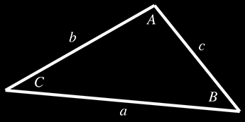

## Exercise

Use the geometric definition of the dot product

```math
\textbf{a} \cdot \textbf{b} = \|\textbf{a}\| \|\textbf{b}\| \cos\theta
```

to prove the law of cosines

## Solution

Recap: The law of cosines



```math
\begin{aligned}

a^2 &= b^2 + c^2 = 2 b c \cos A
\\
b^2 &= a^2 + c^2 = 2 a c \cos B
\\
c^2 &= a^2 + b^2 = 2 a b \cos C
\end{aligned}
```

---

Let's consider vectors $a$, $b$ and $c$ as follows:
- $c$ is a vector from $A$ to $B$
- $a$ is a vector from $B$ to $C$
- $b$ is a vector from $A$ to $C$
> which also means that $b = c + a$

It follows that
```math
b = c + a
\\
a = b - c
```

we will use this to prove that

```math
a^2 = b^2 + c^2 = 2 b c \cos A
```

---

**given**

$a^2$ in vector terms is $\|a\|^2$ and $\|a\|=\sqrt{a \cdot a}$

**then**
```math
a^2 = \|a\|^2 = \sqrt{a \cdot a}^2 = a \cdot a
```

---

```math
\begin{aligned}
\|a\|^2 
&= a \cdot a

\\&=
a \cdot (b - c)

\\&=
a \cdot b - a \cdot c

\\&=
(b - c) \cdot b - (b - c) \cdot c

\\&=
(b \cdot b - c \cdot b) - (b \cdot c - c \cdot c)

\\&=
(b \cdot b - c \cdot b) - (b \cdot c - c \cdot c)

\\&=
b \cdot b - c \cdot b - b \cdot c + c \cdot c

\\&=
b \cdot b + c \cdot c - 2 (b \cdot c)

\\&=
\|b\|^2 + \|c\|^2 - 2 (b \cdot c)

\\&=
\|b\|^2 + \|c\|^2 - 2 (\|b\| \|c\| \cos A)

\\&=
\|b\|^2 + \|c\|^2 - 2 \|b\| \|c\| \cos A

\end{aligned}
```

Given the length of the vectors equal the length of the corresponding sides of the triangle, we can derive the law of cosines:

```math
a^2 = b^2 + c^2 = 2 b c \cos A
```
