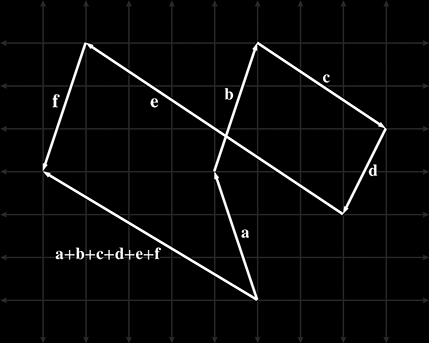

## Exercise

Verify Figure 2.11 numerically:



## Solution

```math
\begin{aligned}

\textbf{a} &= \begin{bmatrix}-1 \\  3\end{bmatrix}, \\
\textbf{b} &= \begin{bmatrix} 1 \\  3\end{bmatrix}, \\
\textbf{c} &= \begin{bmatrix} 3 \\ -2\end{bmatrix}, \\
\textbf{d} &= \begin{bmatrix}-1 \\ -2\end{bmatrix}, \\
\textbf{e} &= \begin{bmatrix}-6 \\  4\end{bmatrix}, \\
\textbf{f} &= \begin{bmatrix}-1 \\ -3\end{bmatrix}, \\

\textbf{a} + 
\textbf{b} + 
\textbf{c} + 
\textbf{d} + 
\textbf{e} + 
\textbf{f} &=

\begin{bmatrix}-1 \\  3\end{bmatrix} +
\begin{bmatrix} 1 \\  3\end{bmatrix} +
\begin{bmatrix} 3 \\ -2\end{bmatrix} +
\begin{bmatrix}-1 \\ -2\end{bmatrix} +
\begin{bmatrix}-6 \\  4\end{bmatrix} +
\begin{bmatrix}-1 \\ -3\end{bmatrix}

\\
&=
\begin{bmatrix}
    -1 +  1 +  3 + -1 + -6 + -1
        \\
    3 +  3 + -2 + -2 +  4 + -3
\end{bmatrix}

\\
&=
\begin{bmatrix}
    -5 \\ 3
\end{bmatrix}

\end{aligned}
```
