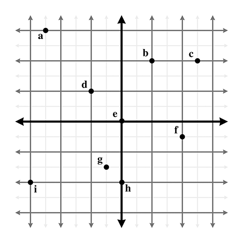

## Exercise

Give the coordinates of the following points. Assume the standard 2D conventions. The darker grid lines represent one unit.

## Solution

| point | x    | y    |
| ----- | ---- | ---- |
| a     | -2.5 | 3.0  |
| b     | 1.0  | 2.0  |
| c     | 2.5  | 2.0  |
| d     | -1.0 | 1.0  |
| e     | 0.0  | 0.0  |
| f     | 2.0  | -0.5 |
| g     | -0.5 | -1.5 |
| h     | 0.0  | -2.0 |
| i     | -3.0 | -2.0 |
