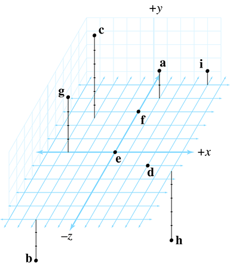

## Exercise

Give the coordinates of the following points:

## Solution

| point | x    | y    | z    |
| ----- | ---- | ---- | ---- |
| a     | 1.0  | 2.0  | 4.0  |
| b     | -3.0 | -3.0 | -5.0 |
| c     | -3.0 | 6.0  | 2.5  |
| d     | 3.0  | 0.0  | -1.0 |
| e     | 0.0  | 0.0  | 0.0  |
| f     | 0.0  | 0.0  | 3.0  |
| g     | -3.5 | 4.0  | 0.0  |
| h     | 5.0  | -5.0 | -1.5 |
| i     | 4.0  | 1.0  | 5.0  |
